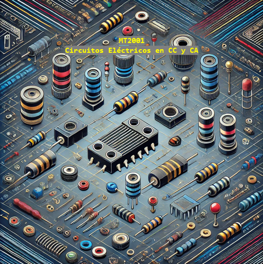

# Circuitos en CC y CA - Recursos Didácticos Avanzados

Este repositorio contiene ejemplos prácticos de conceptos fundamentales del curso de "Circuitos de **corriente continua (CC)** y **corriente alterna (CA)**" del Tecnológico de Costa Rica. Está diseñado para estudiantes que deseen profundizar en el análisis de circuitos eléctricos y su comportamiento en diferentes condiciones.

## Tópicos

1. **Circuitos en Corriente Continua (CC)**:
    - Ley de Ohm.
    - Divisores de voltaje y corriente.
    - Análisis de redes resistivas.
    - Circuitos en serie y paralelo.
    - Leyes de Kirchhoff (Ley de Corriente de Kirchhoff y Ley de Voltaje de Kirchhoff).

2. **Circuitos en Corriente Alterna (CA)**:
    - Análisis de impedancia en circuitos RLC.
    - Resonancia en circuitos RLC.
    - Factor de potencia.
    - Respuesta transitoria y respuesta forzada.
    - Análisis fasorial.
    - Amortiguamiento en circuitos RLC (subamortiguado, críticamente amortiguado, sobreamortiguado).
  
## Contenidos

- [¿Cómo aplicar la Ley de Ohm?](./Ley_de_Ohm.ipynb)
- [¿Cómo se produce el desfase entre voltaje y corriente en bobinas y capacitores?](./Desfases_i_v_en_CyL.ipynb)
- [¿Cómo se comportan los circuitos RLC en los casos de subamortiguamiento, amortiguamiento crítico y sobreamortiguamiento?](./RLC_Amortiguamiento.ipynb)
- [¿Cómo se calculan los valores RMS y Promedio en Corriente Alterna (CA)?](./Valores_RMS_y_Promedio_en_Corriente_Alterna.ipynb)
- [¿Cómo realizar las transformaciones Delta-Estrella y Estrella-Delta en circuitos eléctricos?](./Delta_Estrella.ipynb)
- [¿Qué es el factor de potencia y cómo se puede corregir para optimizar el uso de energía en los circuitos?](./Corrección_Factor_de_Potencia.ipynb)

## Objetivos

El objetivo de este repositorio es proporcionar ejemplos claros y bien documentados para ayudar a:
- Entender los principios básicos de los circuitos eléctricos en **CC** y **CA**.
- Visualizar cómo varían las corrientes y voltajes en los distintos tipos de configuraciones de circuitos.
- Analizar la respuesta natural y forzada en circuitos RLC en el dominio del tiempo y la frecuencia.
- Implementar simulaciones utilizando herramientas de software para visualizar el comportamiento teórico de los circuitos.

## Requisitos

Para ejecutar los ejemplos de este repositorio necesitarás:

- **Python 3.x** (para simulaciones y gráficos)
- **Matplotlib** (para la visualización de gráficas)
- **NumPy** (para cálculos matemáticos y simulaciones)

## Contribuciones

¡Las contribuciones son bienvenidas! Si tienes sugerencias, mejoras o ejemplos adicionales que te gustaría agregar, por favor abre un *issue* o envía un *pull request*. Este repositorio está destinado a ser una herramienta educativa en constante evolución.

## Autor
**Felipe Meza-Obando**

## Licencia
Este proyecto está bajo la Licencia GPL-3.0 license y además la Licencia MIT - vea el archivo `LICENSE` para más detalles.

---

Esperamos que encuentres útiles los recursos de este repositorio y te invitamos a ser parte de nuestra comunidad de aprendizaje y colaboración.
